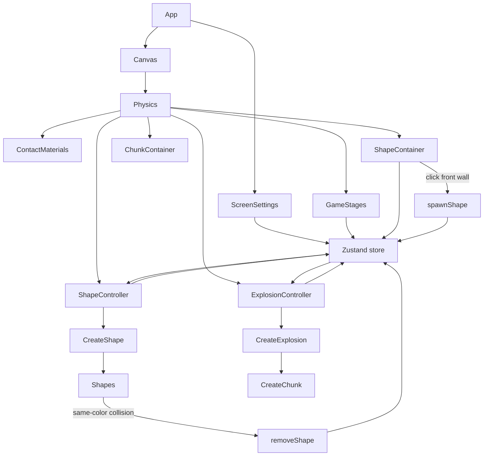

# R/G/B: a Tetris-like game of stacking.

Stack to the top without allowing same-color shapes to touch.

_This is a work in progress._

## Built With
* [@react-three/fiber](https://www.npmjs.com/package/@react-three/fiber) - React renderer for three.js.
* [@react-three/cannon](https://www.npmjs.com/package/@react-three/cannon) - React hooks for cannon-es, a rigid body physics engine.
* [zustand](https://www.npmjs.com/package/zustand) - state-management solution that uses simplified flux principles.
* [@react-three/drei](https://www.npmjs.com/package/@react-three/drei) - Helper library for @react-three/fiber.

## Game Architecture

The game is a React and three.js scene built around a small Zustand store, Cannon physics, and a set of stage and controller components. Players stack red, green, and blue shapes inside an invisible physics container. Shapes settle under gravity, and same-color collisions remove shapes by turning them into short-lived explosion chunks.

### Runtime Flow

`App.jsx` owns the top-level render tree. It creates the root `Canvas`, configures the camera and lights, and mounts the Cannon `Physics` world. Inside that physics world, the game systems run side by side: stage logic, contact materials, shape spawning, active shape rendering, explosion rendering, and invisible physics containers.

`ScreenSettings` measures the device screen and stores the derived container height in Zustand. That shared container sizing drives the camera placement, shape container walls, chunk container walls, and stack-height win condition.

`GameStages` mounts the stage components together. `IntroGame` renders the animated title and puppet layout, then advances on click. `IntroLevel` seeds the playfield with three starter shapes and switches to `PlayLevel`. `PlayLevel` watches the bounding-box height of active shapes and moves to `WinLevel` once the stack rises above the container.

`ShapeContainer` creates the invisible walls that hold gameplay shapes. Its front wall listens for clicks during `PlayLevel`; each click passes the world-space point to `spawnShape`, which adds a new shape descriptor to the store.

`ShapeController` renders the store's active shapes through `CreateShape`. The concrete shape components create their own Cannon bodies and listen for collisions. When a shape touches another shape with the same color, it calls `removeShape`.

`removeShape` deletes the active shape and records an explosion in the store. `ExplosionController` renders those explosions through `CreateExplosion`, which creates four smaller physics chunks through `CreateChunk`. Chunks are cleaned up after falling below the scene.

`ContactMaterials`, `configs/physics.js`, `ShapeContainer`, and `ChunkContainer` define the collision rules. Gameplay shapes collide with shapes and the main container, while explosion chunks use their own collision group and side walls so they can burst away from the playfield without affecting the stack.

## Authors

* **Patrick Young** - [Patrick Young](https://github.com/patrick-s-young)

## License

This project is licensed under the MIT License - see the [LICENSE](LICENSE) file for details.

https://github.com/user-attachments/assets/09b16df3-000f-42ae-aa9a-e1c4dc3b8912

https://github.com/user-attachments/assets/dbc31094-7296-44c5-b415-b12fbc9cdd06

